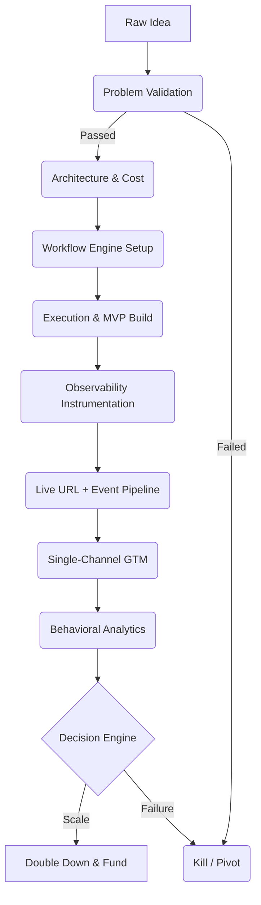
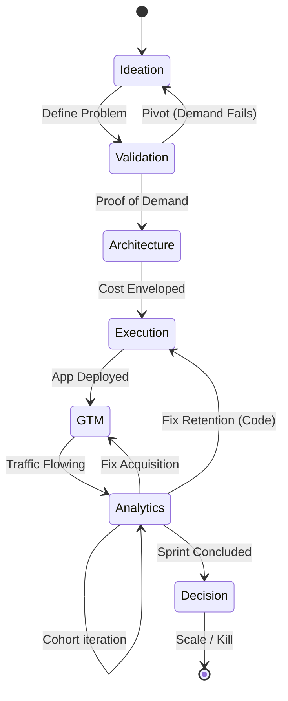

# System Diagrams

This document contains representations of the core flows within the FoundryOS. Visual interpretations help anchor the abstract concepts into executable processes.

---

## 1. The Core Lifecycle Diagram
The overarching sequence from idea intake to decision.



---

## 2. Architecture Diagram
The high-level technology abstraction for an MVP rollout.

```ascii
+-----------------------------------------------------------+
|                   Presentation Layer                      |
| (React, Next.js, No-Code Frontends, Single Page Apps)     |
+-----------------------------------------------------------+
                              | HTTPS / GraphQL
                              v
+-----------------------------------------------------------+
|                 Application / API Layer                   |
| (Vercel Functions, AWS Lambda, Workflow Automations)      |
+-----------------------------------------------------------+
               |                              |
               v                              v
+---------------------------+   +---------------------------+
|    Infrastructure / DB    |   | Observability / Analytics |
| (PostgreSQL, Supabase, S3)|   |  (Logtail, Sentry, GA4)   |
+---------------------------+   +---------------------------+
```

---

## 3. The State Machine Representation
Illustrating regressions within the startup lifecycle based on evidence.



---

## 4. Trigger-Action-Outcome Matrix
A typical workflow mapping inside the Workflow Engine.

| Trigger Event            | System Action                         | Success Outcome              | Failure Path (Escalation)    |
|--------------------------|---------------------------------------|------------------------------|------------------------------|
| New User Signup          | Send Auth Email (SendGrid)            | User clicks verification     | Alert Dev on SMTP failure    |
| Core Action Completed    | Log to Amplitude, Update DB state     | North Star Metric +1         | Retry Logic / Notification   |
| API Timeout              | Log to Sentry, Status Page Update     | User sees graceful error     | PagerDuty alerts Engineer    |
